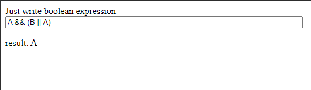

# Minimizer of Boolean Algebra Functions

## Description

Multiplatform library witch can make the expression easier. This library can be used on JVM, JS, Swift.

## How use it

### Classes 

You can use exist classes in  [org.expressions.impl](src/commonMain/kotlin/org/expressions/impl) for create condition and [SimplerBooleanExpression](src/commonMain/kotlin/org/expressions/SimplerBooleanExpression.kt) for doing simple your condition.

For example with using constructor:

```kotlin
import org.expressions.SimplerBooleanExpression
import org.expressions.impl.*

// A && (B || A) -> A
fun main() {
    // Define condition "A && (B || A)"
    val condition = AndCondition(
        Condition("A"),
        OrCondition(
            Condition("B"),
            Condition("A"),
        )
    )
    println(condition.toString()) // (A && (B || A))
    
    // Create instance SimplerBooleanExpression 
    val simpler = SimplerBooleanExpression()
    // Make easier
    val simpled = simpler.simplify(condition)
    println(simpled.toString()) // A
}

```

For example with using methods: 

```kotlin
import org.expressions.SimplerBooleanExpression
import org.expressions.impl.*

// A && (B || A) -> A
fun main() {
    // Define condition "A && (B || A)"
    val condition = Condition("A").and(Condition("B").or(Condition("A")))
    println(condition.toString()) // (A && (B || A))
    
    // Create instance SimplerBooleanExpression 
    val simpler = SimplerBooleanExpression()
    // Make easier
    val simpled = simpler.simplify(condition)
    println(simpled.toString()) // A
}
```


### Custom conditions 

If you want to use custom conditions, you need implement interface [SimplifiedCondition,](src/commonMain/kotlin/org/expressions/SimplifiedCondition.kt) and then you could use [SimplerBooleanExpression](src/commonMain/kotlin/org/expressions/SimplerBooleanExpression.kt) similarly first code examples.

---

## Build

#### Build JVM

Run bash

```bash
./gradlew jvmJar
```

Then go to `build/libs` for take *.jar

#### Build JS

You can run website and try parse boolean expressions fom string and see result optimization.



If you want it, you should run this bash command.

```bash
./gradlew jsBrowserDistribution
```

And after that open index.html from `build/distributions/`.

// TODO add implements with using array

#### Build Swift

// TODO add implements with using macOS

---

## Test

Run tests and generate coverage.

```bash
./gradlew koverReport
```
Watch coverage go to `build/reports/kover/html/index.html`

---

## Documentation

Watch now https://tihon-ustinov.github.io/boolean-expression-siplify/

### Build Documentation

#### HTML

If you want HTML documentation

```bash
./gradlew dokkaHtml
```

Then go to `build/dokka/html/index.html`

#### Markdown

If you want Markdown documentation

```bash
./gradlew dokkaGfm
```

Then go to `build/dokka/gfm/index.md`

---

### TODO

- Add implements with using array
- Add implements with using macOS
- Publish to maven central and npm
- Make html with parse string condition and make it easier
